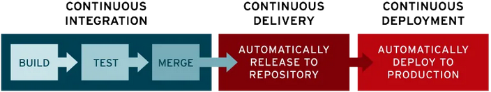

# Deploiement des applications de Pecunia

Le but de cette documentation est de présenter étape par étape comment mettre en place le déploiement en production de notre application.

Si vous voyez des choses à modifier ou à rajouter, n'hésiter pas à faire une issue sur ce repository.

## C'est quoi la "CI/CD" ?

Ce sont des pratiques DevOps, qui désigne l'intégration et la distribution ou le déploiement continus.

Cela a pour objectif de rationaliser et d'accélérer le cycle de vie de développement des logiciels.

 

## Le CI dans le "CI/CD"

CI est l'acronyme pour "Continuous Integration" ou **l'intégration continu** en francais.

Ce processus d'automatisation facilite le merge fréquent des modifications de code vers la branche principales (dev ou main, à voir selon les worklows git des équipes).

Les Github Actions permettent une **homogénéité** de notre codebase.

Que ce soit en front ou dans le back, nous utilisons des workflows afin de :
- Lancer nos tests automatisés (Unitaires > Intégrations > End-to-End)
- De respecter les conventions de qualité de code à l'aide des linters (Eslint pour Angular - Checkstyle pour Spring) 
- De pouvoir vérifier si le projet compile correctement

Cela permet de garantir la fiabilité des modifications du code fusionné tout le long de la vide d'un projet.

Moins de bugs et des corrections plus rapides en production.

## Le CD dans CI/CD

CD est l'acronyme de "Continuous Delivery" ou le **déploiement continu**.

C'est une pratique DevOps consitant à tranférer automatiquement les modifications depuis le référentiel vers l'environnement de production, où elles peuvent être utilisées par les utilisateurs.

Par rapport à la facon traditionnel de la mise en production, cela permet réduire la surcharge des équipes d'administration systèmes qui mettent en production de facon manuel et qui ralentissaient la distribution des applications.

## Les Github Actions pour la CI

### Frontend

C'est un simple fichier qui réunit toutes les étapes :

```yaml
name: CI - Lint // Format // Test

on:
  pull_request:
    push:
      branches: [dev]

jobs:
  build-and-test:
    runs-on: ubuntu-latest

    steps:
      - name: Checkout Code
        uses: actions/Checkout@v4

      - name: Setup Node.js
        uses: actions/setup-node@v4
        with:
          node-version: latest

      - name: Install dependencies
        run: npm ci

      - name: Run unit test
        run: npm run test:ci

      - name: Format with prettier
        run: npm run format

      - name: Lint with eslint
        run: npm run lint

      - name: Build application
        run: npm run build
```

Cela verifie bien que notre application respecte :
- les conventions de code
- les tests automatisées passent au vert
- la compilation est ok

### le Backend

Au niveau de notre api spring, nous avons séparés les actions afin de ne pas surcharger un fichier et d'améliorer la lisibilité.

#### Linting

```yaml
name: Lint with Checkstyle

on:
  pull_request:
    push:
      branches: [dev]

jobs:
  checkstyle:
    runs-on: ubuntu-latest
    steps:
      - name: Checkout Code
        uses: actions/checkout@v4
      - name: Set up JDK 21
        uses: actions/setup-java@v4
        with:
          java-version: "21"
          distribution: "temurin"
          cache: maven
      - name: Run Checkstyle
        run: mvn checkstyle:check
      - name: Generate report
        run: mvn checkstyle:checkstyle
      - name: Upload Checkstyle report
        uses: actions/upload-artifact@v4
        with:
          name: checkstyle-report
          path: target/checkstyle/*
          retention-days: 15
```

Avec Checkstyle, nous vérifions d'abord avec la commande `mvn checkstyle:check` si il y a des violations de notre convention de code, qui suit celle mis en place par Google.

Ensuite, nous créons un reporting via `mvn checkstyle:checkstyle`.

#### Formatting

```yaml
name: Format with Google Java Format

on:
  pull_request:
    push:
      branches: [dev]

jobs:
  formatting:
    runs-on: ubuntu-latest
    steps:
      - uses: actions/checkout@v4
      - uses: axel-op/googlejavaformat-action@v4
        with:
          args: "--skip-sorting-imports --replace"

```

On utilise ici un formatter en adéquation avec la convention de Google avec 'google-java-format'.

#### Compilation et Test automatisées

On va voir si l'application compile et en même temps maven nous permet de lancer nos tests automatisées.

Si de ces deux outils est rouge, ca ne passe pas. La compilation doit passer ET les tests doit passer au vert.

```yml
permissions:
  contents: read

name: CI - Build and Test
on:
  pull_request:
    push:
    branches: ["dev", "main"]

jobs:
  build-and-test:
    name: Build and Test Application
    runs-on: ubuntu-latest
    steps:
      - name: Checkout Code
        uses: actions/checkout@v4

      - name: Set Up JDK 21
        uses: actions/setup-java@v4
        with:
          java-version: "21"
          distribution: "temurin"
          cache: maven
      - name: Build and Run Tests
        env:
          SPRING_PROFILES_ACTIVE: test
        run: ./mvnw clean test --batch-mode --no-transfer-progress

```

## Les Github Actions pour la CD

Pour savoir comment a été gérer le serveur dédié (vps ou serveur maison) pour ce projet, vous pouvez aller sur cette [page](./vps.md).

Pour le projet, nous utilisons la containerisation avec Docker et afin d'orchestrer nos containeurs, nous utilisons docker compose.

**Pourquoi containeriser nos applications ?**

- Environnement isolé et consistant
- Déploiement d'application rapide (bien avec le workflow CI/CD)
- Flexible et Scalable
- La transférabilité d'un serveur à un autre
- Cost Effective
- Permet de rollback facilement avec le Version Control System (VCS) interne des containers

### Exemple avec le frontend

C'est la même chose côté backend, les explications vont pour les deux repos.

```yaml
name: CD - Deploy Frontend

on:
  workflow_run:
    workflows: ['CI - Lint // Format // Test']
    types:
      - completed

  push:
    branches:
      - main
jobs:
  deploy:
    if: ${{ github.event.workflow_run.conclusion == 'success' }}
    runs-on: ubuntu-latest

    steps:
      - name: Checkout Code
        uses: actions/checkout@v4

      - name: Log in Docker Hub
        uses: docker/login-actions@v3
        with:
          username: ${{ secrets.DOCKERHUB_USERNAME }}
          password: ${{ secrets.DOCKERHUB_PASSWORD }}

      - name: Build and Push Docker Image
        run: |
          docker build -t txrigxn/pecunia-front:latest . || exit 1
          docker push txrigxn/pecunia-front:latest
      - name: Deploy to server
        env:
          SSHKEY: ${{ secrets.SSHKEY }}
          VPS_USER: ${{ secrets.VPS_USER }}
          VPS_HOST: ${{ secrets.VPS_HOST }}
          SSH_KNOWN_HOSTS: ${{ secrets.SSH_KNOWN_HOSTS }}
        run: |
          # SSH KEY CONFIG
          mkdir -p ~/.ssh
          echo "$SSHKEY" > ~/.ssh/id_ed25519
          chmod 600 ~/.ssh/id_ed25519
          echo "$SSH_KNOWN_HOSTS" > ~/.ssh/known_hosts

          echo "Pulling Dockers images..."
          docker pull txrigxn/pecunia-front:latest || exit 1

          echo "Shutting down existing containers..."
          docker compose down || exit 1

          echo "Starting new container..."
          docker compose up -d || exit 1

      - name: cleanup
        run: rm -rf ~/.ssh
```

On va décortiquer ce workflow.

```yaml
on:
  workflow_run:
    workflows: ['CI - Lint // Format // Test']
    types:
      - completed

  push:
    branches:
      - main
jobs:
  deploy:
    if: ${{ github.event.workflow_run.conclusion == 'success' }}
    runs-on: ubuntu-latest
```
Si le workflow de la CI n'est pas fini et qu'il n'est pas un succès. 
Le Worklow de la CD ne fonctionnera pas .

```yaml
      - name: Log in Docker Hub
        uses: docker/login-actions@v3
        with:
          username: ${{ secrets.DOCKERHUB_USERNAME }}
          password: ${{ secrets.DOCKERHUB_PASSWORD }}
      - name: Build and Push Docker Image
        run: |
          docker build -t txrigxn/pecunia-front:latest . || exit 1
          docker push txrigxn/pecunia-front:latest
```

On va se connecter au registry de container (ca peut etre Github, Docker ou un self-hosted.)
Puis, on va construire un nouveau container mis à jour avec les modifications de codes venant des features des developpeur.euses.
Ensuite, on pousse sur le registry.

```yaml
 - name: Deploy to server
        env:
          SSHKEY: ${{ secrets.SSHKEY }}
          VPS_USER: ${{ secrets.VPS_USER }}
          VPS_HOST: ${{ secrets.VPS_HOST }}
          SSH_KNOWN_HOSTS: ${{ secrets.SSH_KNOWN_HOSTS }}
        run: |
          # SSH KEY CONFIG
          mkdir -p ~/.ssh
          echo "$SSHKEY" > ~/.ssh/id_ed25519
          chmod 600 ~/.ssh/id_ed25519
          echo "$SSH_KNOWN_HOSTS" > ~/.ssh/known_hosts
          ssh -i ~/.ssh/id_ed25519 ${secrets.VPS_USER}@${secrets.VPS_HOST}

          echo "Pulling Dockers images..."
          docker pull txrigxn/pecunia-front:latest || exit 1

          echo "Shutting down existing containers..."
          docker compose down || exit 1

          echo "Starting new container..."
          docker compose up -d || exit 1

      - name: cleanup
        run: rm -rf ~/.ssh
```
La variable d'environnement `SSHKEY` a été générer sur le serveur dédié et mis en secrets sur l'organisation de Pecunia, afin de l'utiliser sur les deux repositories.

Après s'être connecter en ssh sur le serveur, on va chercher les containers mis à jour.

Un peu de downtime le temps de d'éteindre les services dans l'orchestrateur de containeurs (=docker compose).

Ensuite, avec la commande `docker compose up -d`, on relance nos applications en arrière plan (c'est ce que veut dire le flag -d, --detach) de notre vps.

On finit par supprimer le dossier .ssh pour plus de sécurité.
